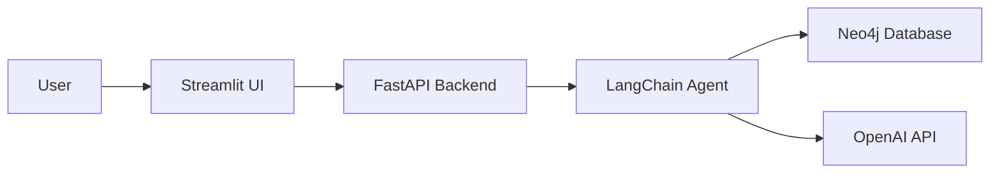

# Healthcare RAG Agent 

[](https://www.python.org/)
[](https://langchain.com/)
[](https://neo4j.com/)
[](https://www.docker.com/)

A Retrieval-Augmented Generation (RAG) agent designed for healthcare information querying, built with LangChain and Neo4j knowledge graphs.

## 📋 Table of Contents
- [Overview](#-overview)
- [Key Features](#-key-features)
- [Architecture](#architecture)
- [Prerequisites](#-prerequisites)
- [Quick Start](#-quick-start)
- [Example Queries](#-example-queries)
- [Database Design](#database-design)
- [Technical Stack](#technical-stack)
- [Acknowledgments](#acknowledgments)

## 🎯 Overview

This project implements a healthcare-focused RAG chatbot that leverages LangChain's capabilities for natural language processing and Neo4j's graph database for structured healthcare data storage. The application provides an intuitive interface for querying complex healthcare relationships and information.

The bundled dataset (`data/*.csv`) models a synthetic Tunisian hospital network: real Tunisian hospitals/clinics grouped by governorate, Tunisian insurers (CNAM and private companies), Tunisian physician/patient names, and billing amounts in Tunisian Dinar (TND). See [`scripts/generate_tunisian_dataset.py`](scripts/generate_tunisian_dataset.py) for how it was generated.

## ✨ Key Features

* **Knowledge Graph Integration** - Neo4j for healthcare data relationships  
* **RESTful API** - FastAPI-powered scalable backend  
* **Interactive UI** - Intuitive Streamlit interface  
* **Containerized** - Docker-based deployment  
* **Multi-Model Support** - Configurable OpenAI models

<a name="architecture"></a>
## 🏗️ Architecture



## 📋 Prerequisites

- Docker and Docker Compose
- OpenAI API access
- Neo4j AuraDB instance
- Python 3.8+

## 🚀 Quick Start

### 1. Clone the Repository

```bash
git clone https://github.com/asanmateu/medgraph-ai
cd medgraph-ai
```

### 2. Environment Configuration

Create a `.env` file in the project root with the variables:

```bash
# OpenAI Configuration
OPENAI_API_KEY=<YOUR_OPENAI_API_KEY>

# Neo4j Database Configuration
NEO4J_URI=<YOUR_NEO4J_URI>
NEO4J_USERNAME=<YOUR_NEO4J_USERNAME>
NEO4J_PASSWORD=<YOUR_NEO4J_PASSWORD>

# Data Source URLs (Tunisian dataset, must be reachable over HTTPS by your
# Neo4j instance, e.g. hosted on GitHub raw or your own object storage)
HOSPITALS_CSV_PATH=<PUBLIC_URL_TO_YOUR_FORK>/data/hospitals.csv
PAYERS_CSV_PATH=<PUBLIC_URL_TO_YOUR_FORK>/data/payers.csv
PHYSICIANS_CSV_PATH=<PUBLIC_URL_TO_YOUR_FORK>/data/physicians.csv
PATIENTS_CSV_PATH=<PUBLIC_URL_TO_YOUR_FORK>/data/patients.csv
VISITS_CSV_PATH=<PUBLIC_URL_TO_YOUR_FORK>/data/visits.csv
REVIEWS_CSV_PATH=<PUBLIC_URL_TO_YOUR_FORK>/data/reviews.csv

# Model Configuration
HOSPITAL_AGENT_MODEL=gpt-3.5-turbo-1106
HOSPITAL_CYPHER_MODEL=gpt-3.5-turbo-1106
HOSPITAL_QA_MODEL=gpt-3.5-turbo-0125

# Service Configuration
CHATBOT_URL=http://host.docker.internal:8000/hospital-rag-agent
```

### 3. Run with Docker

Ensure your Neo4j AuraDB instance is running, then execute:

```bash
make build && make start
```

### 4. Stopping the Application

```bash
make stop
```

### Accessing the Services

- **API Documentation**: `http://localhost:8000/docs`
- **User Interface**: `http://localhost:8501`


## 💬 Example Queries

Try asking the agent:
- "Which hospitals have the highest patient satisfaction?"
- "Show me physicians specializing in cardiology"
- "What's the average wait time for emergency visits?"
- "Which governorate had the most CNAM visits in 2023?"
- "What is the current wait time at Hopital Charles Nicolle?"

<a name="database-design"></a>
## 🗄️ Database Design

The application utilizes a graph database structure optimized for healthcare data relationships. Understanding this schema will help formulate effective queries.

### Graph Schema Overview


### Node Properties

The following node types and their properties are available for querying:


### Relationship Properties

Relationships between nodes contain additional contextual information:


<a name="technical-stack"></a>
## 🛠️ Technical Stack

- **LangChain**: Orchestration framework for LLM applications
- **Neo4j**: Graph database for healthcare data storage
- **FastAPI**: High-performance API framework
- **Streamlit**: Interactive web application framework
- **Docker**: Containerization platform
- **OpenAI GPT-3.5**: Language model for natural language understanding

## Acknowledgments

This project builds upon the excellent foundation provided by Real Python's LLM RAG Chatbot [tutorial](https://realpython.com/build-llm-rag-chatbot-with-langchain).


