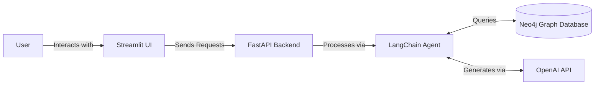

# 🇹🇳 Tunisia Health RAG Chatbot

[](https://www.python.org/)
[](https://langchain.com/)
[](https://neo4j.com/)
[](https://www.docker.com/)

A specialized Retrieval-Augmented Generation (RAG) agent designed for querying healthcare information in Tunisia. Built with LangChain, Neo4j knowledge graphs, and FastAPI, this chatbot provides intuitive access to complex healthcare data.

---

## 📋 Table of Contents
- [Overview](#-overview)
- [Key Features](#-key-features)
- [Interactive Interface](#-interactive-interface)
- [Architecture](#-architecture)
- [Prerequisites](#-prerequisites)
- [Quick Start](#-quick-start)
- [Example Queries](#-example-queries)
- [Database Design](#-database-design)
- [Technical Stack](#-technical-stack)

---

## 🎯 Overview

This project implements a healthcare-focused RAG chatbot that leverages LangChain for natural language processing and Neo4j's graph database for structured data storage. 

The dataset models a synthetic Tunisian hospital network, including:
- Real Tunisian hospitals and clinics grouped by governorate
- Tunisian insurers (e.g., CNAM, private companies like GAT Assurances, STAR Assurances)
- Tunisian physician and patient names
- Billing amounts in Tunisian Dinar (TND)

---

## ✨ Key Features

- **Knowledge Graph Integration:** Powered by Neo4j for deep relationship mapping in healthcare data.
- **RESTful API:** Scalable backend built with FastAPI.
- **Interactive UI:** A clean, user-friendly Streamlit interface.
- **Containerized:** Easily deployable using Docker.
- **Multi-Model Support:** Configurable OpenAI models for optimal responses.

---

## 💻 Interactive Interface

Here is a glimpse of the chatbot in action:


---

## 🏗️ Architecture



---

## 🛠️ Prerequisites

- **Docker** and **Docker Compose**
- **OpenAI API Key**
- **Neo4j AuraDB** instance
- **Python 3.8+** (for local development)

---

## 🚀 Quick Start

### 1. Clone the Repository

```bash
git clone https://github.com/heikalazzouna-svg/tunisia-health-rag.git
cd tunisia-health-rag
```

### 2. Environment Configuration

Create a `.env` file in the project root with the following variables:

```bash
# OpenAI Configuration
OPENAI_API_KEY=<YOUR_OPENAI_API_KEY>

# Neo4j Database Configuration
NEO4J_URI=<YOUR_NEO4J_URI>
NEO4J_USERNAME=<YOUR_NEO4J_USERNAME>
NEO4J_PASSWORD=<YOUR_NEO4J_PASSWORD>

# Data Source URLs
HOSPITALS_CSV_PATH=https://raw.githubusercontent.com/heikalazzouna-svg/tunisia-health-rag/main/data/hospitals.csv
PAYERS_CSV_PATH=https://raw.githubusercontent.com/heikalazzouna-svg/tunisia-health-rag/main/data/payers.csv
PHYSICIANS_CSV_PATH=https://raw.githubusercontent.com/heikalazzouna-svg/tunisia-health-rag/main/data/physicians.csv
PATIENTS_CSV_PATH=https://raw.githubusercontent.com/heikalazzouna-svg/tunisia-health-rag/main/data/patients.csv
VISITS_CSV_PATH=https://raw.githubusercontent.com/heikalazzouna-svg/tunisia-health-rag/main/data/visits.csv
REVIEWS_CSV_PATH=https://raw.githubusercontent.com/heikalazzouna-svg/tunisia-health-rag/main/data/reviews.csv

# Model Configuration
HOSPITAL_AGENT_MODEL=gpt-3.5-turbo-1106
HOSPITAL_CYPHER_MODEL=gpt-3.5-turbo-1106
HOSPITAL_QA_MODEL=gpt-3.5-turbo-0125

# Service Configuration
CHATBOT_URL=http://host.docker.internal:8000/hospital-rag-agent
```

### 3. Run with Docker

Execute the following commands to build and start the containers:

```bash
make build
make start
```
*(If `make` is unavailable, use `docker compose up --build`)*

### 4. Accessing the Services

- **User Interface:** [http://localhost:8501](http://localhost:8501)
- **API Documentation:** [http://localhost:8000/docs](http://localhost:8000/docs)

### 5. Stopping the Application

```bash
make stop
```

---

## 💬 Example Queries

Try asking the agent questions tailored to the Tunisian healthcare dataset:
- *"What is the average duration in days for closed emergency visits?"*
- *"What are patients saying about the nursing staff at Hopital Sahloul?"*
- *"What was the total billing amount charged to each payer for 2023?"*
- *"What is the average billing amount per day for STAR Assurances patients?"*
- *"Which governorate had the most CNAM visits in 2023?"*

---

## 🗄️ Database Design

The application utilizes a graph database structure optimized for healthcare data relationships.

### Graph Schema Overview

- **Hospitals:** Connected to regions, patients, and visits.
- **Patients:** Linked to their visits, reviews, and primary payers.
- **Visits:** Serve as the central nodes connecting patients, hospitals, physicians, and payers.
- **Payers:** Insurance companies like CNAM, STAR Assurances, and GAT Assurances.

---

## 💻 Technical Stack

- **LangChain:** Orchestration framework for LLM applications
- **Neo4j:** Graph database for structured healthcare data storage
- **FastAPI:** High-performance REST API framework
- **Streamlit:** Interactive web application framework for the frontend
- **Docker:** Containerization platform for consistent deployments
- **OpenAI:** Language model for natural language understanding and generation
